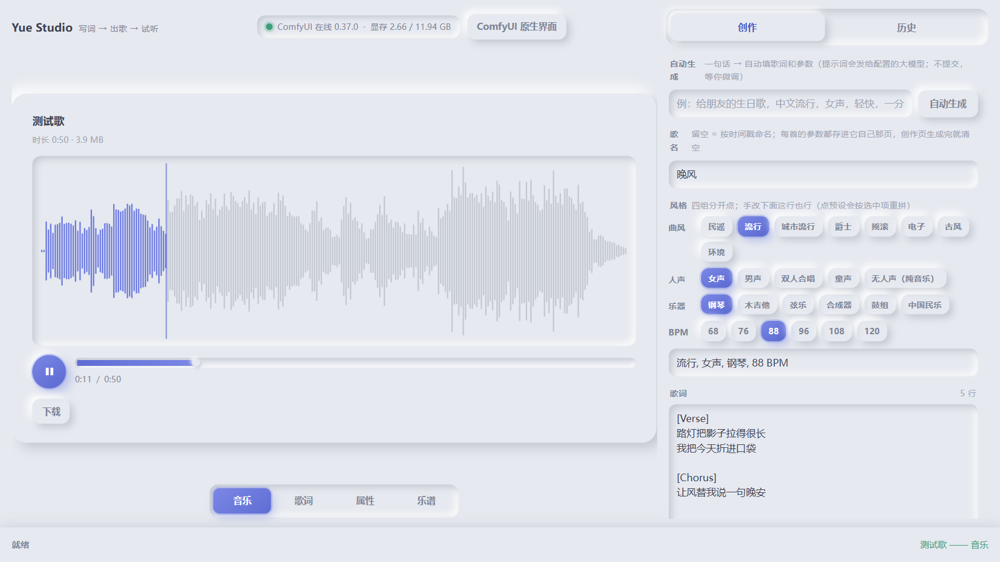
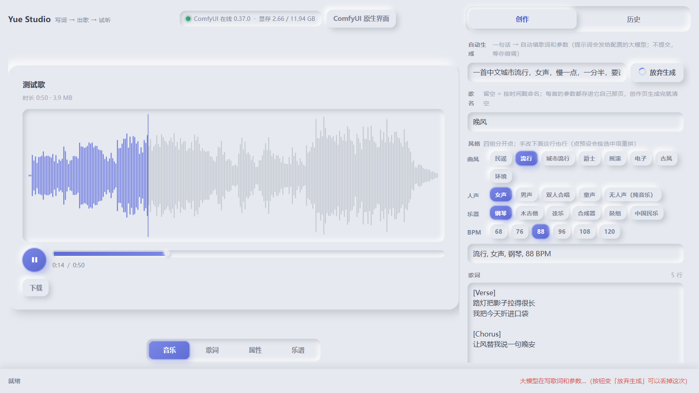
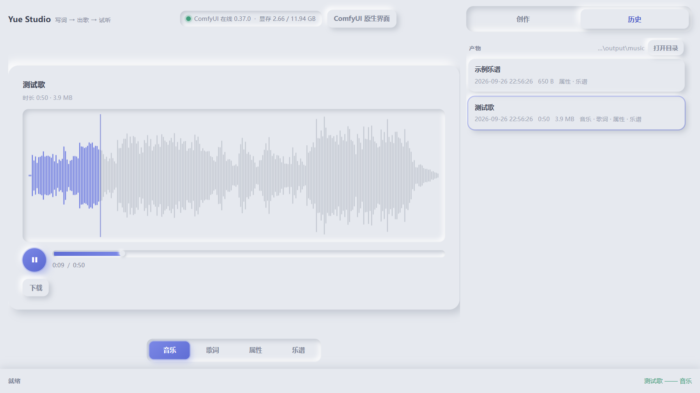
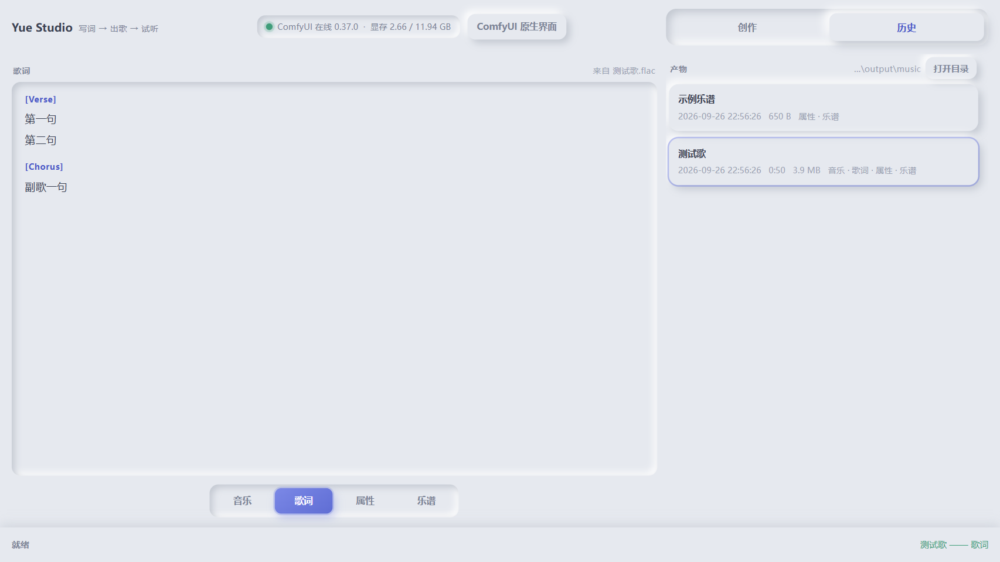
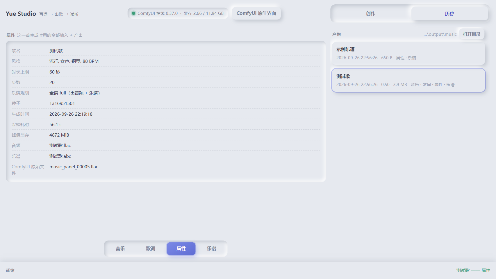
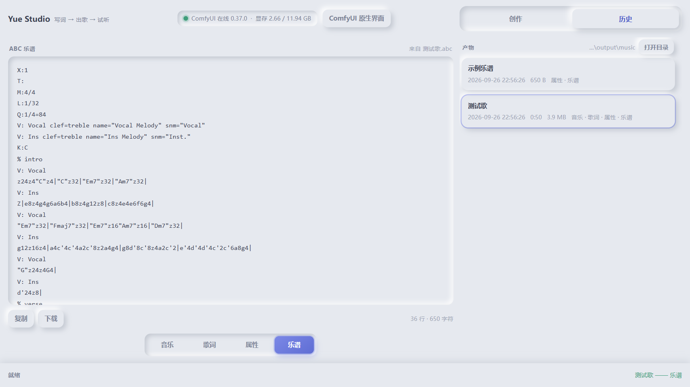
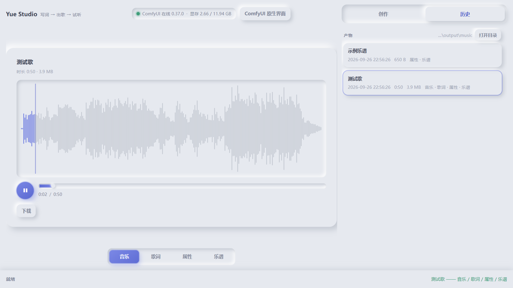

# Yue Studio

本地 YuE2 出歌的**画布式面板**：写风格 + 歌词 + 歌名 → **出歌 / 出 ABC 乐谱** → 主区直接试听（真波形、可拖进度），
同一首还能翻到**歌词**和**属性**（这一首用的全部输入与产出）。历史里**一首歌一张卡**，随手翻、随手删。
**还能一句话自动填好歌名、歌词和参数**（可选，接你自己配的大模型；填完不提交，等你微调）。
单文件前端、零构建、零 CDN、**服务端零第三方依赖**（只用 Python 标准库）。

**它自己不跑模型**：出歌的还是 ComfyUI，面板跟它只有两个接触点 —— **ComfyUI 的根目录**（读 `output\`）和
**它的端口** —— 所以面板能单独放、单独搬、指向任何一份同机的 ComfyUI。（姊妹项目
[Qwen-canvas](https://github.com/Offblink/Qwen-canvas) 是同一套接缝，那个管出图，这个管出歌。）

> A neumorphic panel for a local YuE2 (ComfyUI) checkpoint: style + lyrics + title → song or ABC score,
> waveform player, per-song lyrics/parameters pages, one card per song in history, plus an optional
> one-line "autotune" that fills title, lyrics and parameters. Single-file frontend, no build, no CDN,
> **stdlib-only server** (no venv).















## 快速开始（Windows）

前提：一份带 YuE2 支持的 ComfyUI（0.37.0 起原生支持，不用装 custom node）+ Python 3.12/3.13 + 出歌权重。
权重只有一个文件 `yue2_3b_int8_convrot.safetensors`（3.96 GB，**CC-BY-NC-4.0 非商用**，VAE 与文本编码器都在里面），
缺了面板会提示并帮你断点续传。

```bat
copy studio.json.example studio.json      REM 改成你的 ComfyUI 路径（相对路径按面板目录解析）
打开乐坊.cmd                              REM → http://127.0.0.1:8190
```

停面板：`powershell -File yue_studio.ps1 -Stop`（只杀面板，**不碰 ComfyUI**）。
点「生成」时面板会把 ComfyUI 拉起来（`comfy_autostart: false` 就只当前端），
**停 ComfyUI 归你自己的那套停法**（面板只管起，不管停）。

不用建 venv：服务端只用标准库，启动时按 `YUE_PYTHON` → 面板目录下的 `.venv` → 系统 Python 的顺序找解释器。

## 界面

- **顶栏**：左边品牌，中间 ComfyUI 的状态（在线 / 版本 / 显存）和 `ComfyUI 原生界面` 按钮，
  右边 **创作 / 历史** 页签。
- **主区（2/3）**：**音乐 / 歌词 / 属性 / 乐谱** 四页，用底部的滑块切。
- **侧栏（1/3）**：**创作**（写歌）和**历史**（一首歌一张卡）两页。
- **状态栏**：左边是阶段、进度与速度/预计剩余，右边是提示消息和 `停止生成`。
  **进度只认真实数据** —— 读不到就显示来回滑动的等待条，不编一个百分比出来。

## 创作页

- **自动生成（可选）**：写一句话（例：`给朋友的生日歌，中文流行，女声，轻快，一分半，顺便出个谱`）→
  **歌名、歌词、四组风格、时长、步数、数量、乐谱规划一次填好**。**填完不提交** —— 等你继续微调，
  点不点「生成歌曲」永远你自己定。等的那几十秒按钮里会转圈、文字变 **「放弃生成」**：点一下就丢掉这次请求，
  参数一个都不改。走 `studio.json` 的 `llm`（**任何 OpenAI 兼容端点**都行）；
  **没配就禁用这一格**（会写明缺什么），出歌链路一点不受影响。提示词会发给这个服务商，用之前自己掂量。
- **风格四组分开点**：`曲风 / 人声 / 乐器 / BPM` 各一行，单选，**中文预设**（来自 `studio.json` 的 `presets`，
  想改直接改配置）。四组选中项拼成下面那行中文风格句 —— 那行就是发给模型的原话，手改也行
  （点任何一组会按四组重拼）。
- **歌词**：一行一句，`[Verse] [Chorus] [Bridge] [Outro]` 一键插入、载入 `.txt`、实时行数。
- **歌名**：留空 = 按时间戳起（`song_20260926_2210`）。填了就**这就是文件名**（`生日歌.flac` / `生日歌.abc`），
  重名自动加 `_2`；Windows 非法字符会被换掉，中文照常。
- **参数**：最长时长 / 步数 / 数量 / 种子（`🎲` 换随机）/ 乐谱规划三档；`Ctrl+Enter` 提交。
- **提交那一刻才读参数**：等歌的那几十秒里，歌词风格、页签、历史、播放全都照用。
- **生成完创作页会自动清空**（歌名 / 歌词 / 风格句 / 四组选中 / 数字回默认），留给下一首 ——
  这一首的参数已经存在它自己的「属性」页里了。

## 怎么用

- **产物**：历史页表头写着产物目录，旁边 **「打开目录」** 一点就在资源管理器里打开它（会弹到最前面）。
- **历史**：一首歌一张卡，最新在前，副行是时间 / 时长 / 大小 + 这一首能展开成哪几页；
  点它 = 载入「音乐」（有音频就播放）。悬停时卡片右上角出现两个小按钮：
  - `✎` **改名**：改的是**歌名** —— 三件产物一起改名，**「属性」页里的歌名立刻跟着变**；
    正在放的话接着放，不回到开头。撞上已有的一首会直接拒绝（不悄悄加 `_2`），空名字也不收。
  - `×` **删除**：弹一个确认框（自绘的，不是浏览器原生那种）→ 删这一首的全部产物。
- **音乐**：整首解码成真波形，播放/暂停、进度条与波形都能点能拖。**切页、再点同一张卡都不会打断播放**。
- **歌词**：这首歌的歌词，`[Verse]` / `[Chorus]` 当小标题。
- **属性**：这一首**生成时用的全部输入 + 产出** —— 歌名、风格串、时长上限、步数、种子、乐谱规划、
  生成时间、采样耗时、峰值显存、两个产物文件名、ComfyUI 原始文件名。
  （没有记录时只显示文件本身的信息，不会编内容出来。）
- **乐谱**：ABC 文本可看、可复制、可下载；刚生成的自动显示。
- **权重**：缺权重时顶部出提示条 + 「下载权重 3.96 GB」，进度走状态栏，下完自动核 sha256。
- **ComfyUI**：右上角灯显示在线状态与版本 / 显存；`ComfyUI 原生界面` 没在跑时会**先拉起再打开**官方 UI
  （出歌时也会自动拉起，所以没有单独的「拉起」按钮）。

## 配置

优先级 **环境变量 `YUE_<KEY>` > 同目录 `studio.json` > 默认值**；相对路径按面板目录解析。

| studio.json | 环境变量 | 默认 | 作用 |
|---|---|---|---|
| `comfy_root` | `YUE_COMFY_ROOT` | `<面板>\ComfyUI` | ComfyUI 根目录 |
| `output_dir` | `YUE_OUTPUT_DIR` | `<comfy_root>\output` | ComfyUI 原始落点（中转） |
| `songs_dir` | `YUE_SONGS_DIR` | `<output_dir>\music` | **产物目录**（历史列表读这儿） |
| `comfy_python` | `YUE_COMFY_PYTHON` | `<comfy_root>\.venv\Scripts\python.exe` | 拉起 ComfyUI 用的解释器 |
| `comfy_log` | `YUE_COMFY_LOG` | `<comfy_root>\comfy_server.log` | 拉起时它的输出（**日志文件名随你的启动器**：面板自己拉起时写这个名，你用别的启动器起的就把它的日志路径写这儿） |
| `comfy_cmd` | — | `["main.py","--listen","127.0.0.1","--port",<comfy_port>]` | 相对 `comfy_root` 执行 |
| `comfy_autostart` | `YUE_COMFY_AUTOSTART` | `true` | `false` = 面板绝不自己拉 ComfyUI |
| `presets` | — | 内置四组中文预设 | 创作页的 `曲风/人声/乐器/BPM` 清单 |
| `llm`（可选） | `YUE_LLM_*` | 无 | **自动生成**用的大模型：`base_url` / `model` / `api_key_env` / `proxy` / `timeout` / `max_tokens` |
| — | `YUE_PANEL_PORT` | `8190` | 面板端口 |
| — | `YUE_COMFY_PORT` | `8188` | ComfyUI 端口 |

**api_key 不写进 `studio.json`**：面板按 `llm.api_key_env` 指定的变量名去**环境变量**里找
（Windows 上读不到还会去注册表里找同名用户变量，所以 `setx` 配过一次就一直有效），
找不到就禁用「自动生成」并说明缺什么。`YUE_LLM_API_KEY` 这个名字总能兜底。

## 实测

2026-09-26，RTX 5070 Ti Laptop 12 GB + ComfyUI 0.37.0 + `yue2_3b_int8_convrot`：

| 动作 | 耗时 |
|---|---|
| 只出乐谱 ABC | **15.2 s**（接口）/ **18.3 s**（点按钮，含 ComfyUI 就绪等待） |
| 出歌 · 全谱 full（90 秒上限，2 段歌词） | **52.4 s** |
| 出歌 · 全谱 full（150 秒上限，中文歌词，四组预设点出来的） | **73.7 s** |
| 出歌 · 不要乐谱 off（60 秒上限） | **58.9 s**，产物 1:01 / 4.3 MB |
| 出歌 · 全谱 full（60 秒上限 / 20 步 / 带歌名） | **61.1 s** |
| 自动填写歌名 + 歌词 + 全部参数（思考型模型） | **53–56 s** |
| 峰值显存 | **4872–5040 MiB**（12 GB 卡余量很大） |

中文歌名、歌词、风格全程不乱码；「自动生成」填完不会自己开跑，GPU 一直空着。

## 边界

- 只支持**同机**的 ComfyUI（要直接读它的 `output\`）；跨机器得另做一套。
- 单人本地工具：**没有登录鉴权**，面板能删产物目录里的文件 —— **别往公网暴露**。
- **自动生成会把你的提示词发给 `llm` 配置的服务商**；不想要就别配 `llm`，这一格会自动禁用。
- 出歌权重是 **CC-BY-NC-4.0（非商用）**，选权重前先确认授权。
- 起停包装是 PowerShell（Windows）；面板本体跨平台（`python yue_studio.py`）。

## 目录

```
打开乐坊.cmd / yue_studio.ps1     起面板 + 开浏览器（-NoBrowser 只起；-Stop 只停面板）
studio.json(.example)             配置样例（拷成 studio.json；那份已 gitignore）
yue_studio.py / yue_studio.html   面板本体（标准库）/ 单文件前端
vendor/                           gsap.min.js + Flip.min.js（随仓内置，不连 CDN）
MUSIC_NOTES.md                    实现细节与取舍（接口、状态机、踩过的坑）
```

产物目录里每首歌是**同名三件**：`<歌名>.flac`（音频）、`<歌名>.abc`（乐谱，勾了规划才有）、
`<歌名>.json`（这一首的参数，「属性」页读它）。

## 相关项目

| | |
|---|---|
| **Qwen-canvas**（姊妹面板，管出图） | [Offblink/Qwen-canvas](https://github.com/Offblink/Qwen-canvas) |
| **YuE2**（出歌模型，ComfyUI 原生支持） | 权重 [Comfy-Org/YuE2](https://huggingface.co/Comfy-Org/YuE2)（CC-BY-NC-4.0） |
| **ComfyUI**（后端，出歌与显存都在它那） | [Comfy-Org/ComfyUI](https://github.com/Comfy-Org/ComfyUI)（GPL-3.0） |
